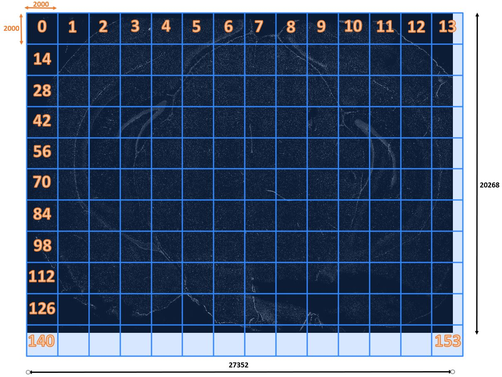
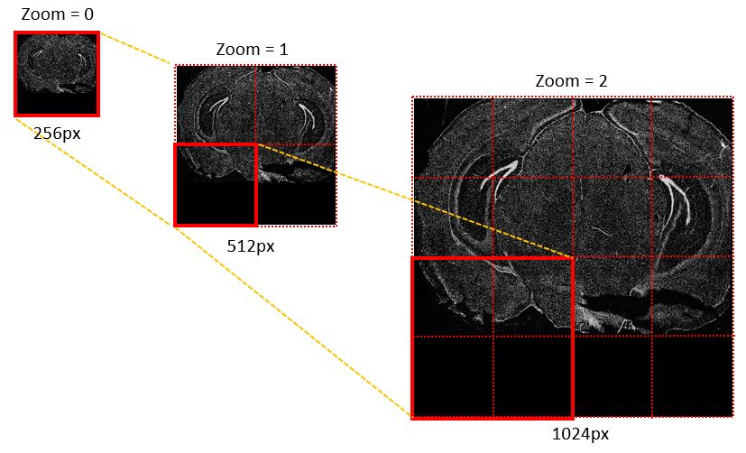
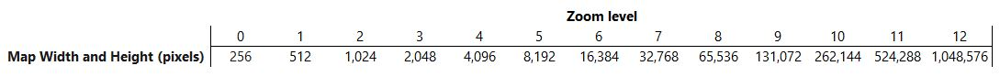
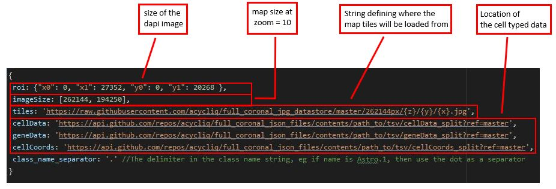

Probabilistic Cell typing by In situ Sequencing
==============================================

A pipeline to cell type and visualise iss data. It implements the cell calling algorithm described in [[Qian, X., et al. Nature Methods (2019)]](#1) (This writeup is not finished)


## How to
There are three stages involved:
- [Preprocessing](#Preprocessing) 
- [Cell typing](#Cell-typing) 
- [Visualisation](#The-viewer) 

The preprocessing stage prepares the data for the cell typing step which, when finished generates the flatfiles to be fed into the viewer. 

## Preprocessing
The main purpose is to tell whether a spot falls within a cell soma and if that happens, which cell it is.
We need as an input the ```label_image``` array of the full image and the text file describing the spots found on the image (Gene name and spot coordinates)
A ```label_image``` is an array the same size as the dapi image. Its values represent the label of the real life object (biological cell) which is shown at the corresponding location
of the dapi image. If an element of the  ```label_image``` array is zero, then the corresponding pixel is on the background. Herein the terms ```cellmap``` and ```label_image``` are
used interchangeably, with the latter being the most common in the image segmentation community.

This stage breaks up the ```label_image``` into smaller same-sized chunks/tiles/fov going from the top-left corner of the Dapi to the right and then top to bottom (see image below:)


#### Configuration:
To start preprocessing you need to create a ```PREPROCESSOR``` dictionary in [config.py](./config.py)  defined as follows:
```
PREPROCESSOR: 'dict'
    dictionary with keys:
    'fov_shape':
        list of length 2. The two items of the list represent the size in pixels of the x-side and y-side of the fov respectively
    'fovs_across': 
        Number of fovs along the x-axis (covering the full length of the x-side of the image) (int)
    'fovs_down':
        Number of fovs along the y-axis (covering the full length of the y-side of the image) (int)
    'spots_full':
        the path to the csv with all the spots. Headers should be  'Gene', 'x' and 'y' 
    'cellmap_full':
        the path to the label_image of the dapi
```

#### Notes
 - the total length of the all fovs arranged next to another (either vertically or horizontally) can exceed the size of the corresponding side in the image
as shown in the image above. The dapi image has ```width=27352px``` and ```height=20268px``` and we set ```fovs_across=14``` and ```fovs_across=11``` totalling to 
```28000px``` and ```22000px```, assuming that each fov is square with side length ```2000px```.
- The fov doesnt have to be square. It doesnt even to be equal to the actual fov of the microscope


## Cell typing

## The viewer 
The viewer is a javascript web application running on the client side. Main tools used are 
- [Leaflet](http://leafletjs.com) on a canvas renderer
- [Leaflet](http://leafletjs.com) on a WebGL renderer (due to the sublime [PixiOverlay](https://github.com/manubb/Leaflet.PixiOverlay) class)
- [D3.js](https://d3js.org/)
It implements a [tiled web map](https://en.wikipedia.org/wiki/Tiled_web_map), a very popular technology in map services like GoogleMaps and GIS. 
The backround image is prerendered at different zoom levels and then cut into tiles. The browser, given the zoom level we want to display, fetches all the necessary tiles,
and lays them on the screen in such a manner that they compose a seamless bigger image. 

At the smallest zoom level, the whole background image fits entirely in a small single square with side length 256 pixels. Increasing zoom level by 1 doubles the map dimensions,
hence we now need 4 tiles to cover the whole image as shown in the fig below 



The general rule is: 


The table below lists the map size for the first 12 levels


For a full coronal slice from a mouse brain 10 zoom levels should be enough. A smaller slice, like hippocampus, would need about 6 or 7 zoom levels. 




## References 
<a id="1">[1]</a> 
Qian, X., et al. (2019). Probabilistic cell typing enables fine mapping of closely related cell types in situ. Nat
Methods 17, 101 – 106.

## Contact
[DN](mailto:dimitris.nicoloutsopolos@gmail.com) 

https://acycliq.github.io/full_coronal_section/

