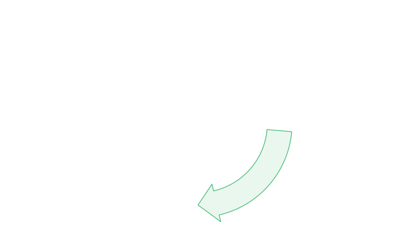

# How it works: the big picture

pciSeq is not a single calculation. It is a **loop** of a few simple steps, repeated
over and over until the answers settle down. Each time around the loop, every step uses
the latest guesses from the other steps, and improves its own guess a little. After
enough rounds the whole thing reaches a steady state, and that steady state is the
answer.

This is what statisticians call **variational inference**, but you do not need the
jargon to follow it. Think of it as four people in a room, each responsible for one
question, passing notes to each other until they all agree.

## The four building blocks

<figcaption>The variational loop. Each block feeds the next, and the last block feeds
back into the first. The loop runs until the spot assignments stop changing.</figcaption>

1. **[Estimate the misread density per gene.](misread-density.md)**
   Work out how much background noise each gene throws off, so genuine signal can be
   told apart from junk.

2. **[Warp the single-cell reference.](warping-the-reference.md)**
   Bend the "dictionary" of cell types so it matches the scale and quirks of *this*
   experiment. This is the subtle block, and the one that is hardest to picture,
   because it happens entirely behind the scenes.

3. **[Assign cells to cell types.](cell-to-celltype.md)**
   With a warped reference in hand, score every cell against every known type and turn
   the scores into probabilities.

4. **[Assign spots to cells.](spots-to-cells.md)**
   With cell types in hand, decide which cell each spot most likely came from (or
   whether it is background noise).

Then the loop closes: new spot assignments change the gene counts per cell, which feeds
straight back into block 1, and round we go again.

## Why a loop and not a pipeline

If you only ran these four steps once, top to bottom, every step would be working from
a rough first guess about the others. The misread estimate would be built on a crude
spot assignment; the cell types on a crude reference; and so on. Running them in a loop
lets each correction ripple through the others. A better misread estimate sharpens the
spot assignments, which sharpens the gene counts, which sharpens the cell types, which
sharpens the spot assignments again. The cycle keeps tightening until there is nothing
left to improve.

## How it knows when to stop

After each full round, pciSeq looks at how much the **spot-to-cell probabilities**
moved. When that movement drops below a small tolerance, the answers have converged and
the loop exits. (There is also a hard cap on the number of rounds, as a safety net.)

## A note before block 2

Three of the four blocks compare against something you can point at: noise levels,
cell-type scores, spot locations. Block 2, warping the reference, is different. It is
**fully latent** - there is no observed "warped reference" to check against. Everything
it does is inferred indirectly from how well the cells end up matching the types. That
is what makes it the most interesting block, and it is where the
[family of inefficiency factors](warping-the-reference.md) lives.