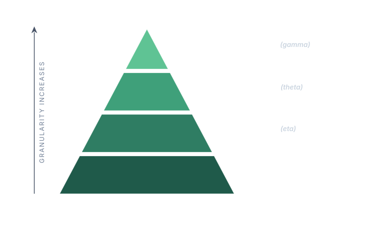

# Block 2: Warping the single-cell reference

This is the subtle one.

The single-cell reference is a dictionary: for every known cell type, it lists the
average expression of every gene, measured in a **separate** scRNA-seq experiment. The
problem is that the in situ experiment in front of you does not behave exactly like that
separate experiment. Genes are detected at different efficiencies, some cells capture
more transcripts than others, and the overall scale is different. If you compared your
cells against the raw reference, the match would be off for reasons that have nothing to
do with biology.

So before comparing, pciSeq **warps** the reference to fit this experiment. It bends and
rescales the expected expression numbers until they live on the same scale as what you
actually observe.

## Why this block is hard to picture

The other three blocks compare against something tangible: noise levels you can count,
cell-type scores you can rank, spot positions you can see. This block has no such
anchor. There is no observed "warped reference" sitting in your data to check the answer
against. The warp is **fully latent**: it is inferred only indirectly, from whether the
warped numbers make the cells match the types better. You never see it directly; you
only see its effect.

## The warp is a stack of scaling factors

The warp is not one number. It is a **family of correction factors**, each one rescaling
the expected expression at a different level of detail. pciSeq calls them
*inefficiencies*, because they mostly describe how much signal is lost relative to the
ideal scRNA-seq reference.

From the broadest to the most specific:

- **Inefficiency** - a single constant baked into the whole reference. It says "in situ
  sequencing detects, say, a fifth of what scRNA-seq sees", and rescales **every gene in
  every cell** by that one factor. Fully systematic: it knows nothing about individual
  genes or cells.

- **eta** ($\eta_g$) - one factor **per gene**, shared across all cells. Some genes are
  detected more efficiently than others; eta captures that. It is the same for every
  cell, but different for every gene.

- **theta** ($\theta_{c,k}$) - one factor **per cell, for each candidate cell type**.
  Some cells simply yield more transcripts than the reference predicts, others fewer;
  theta is a whole-cell **dial** that stretches or shrinks that cell's expected counts
  across all its genes. It is worked out separately for every type the cell might be,
  because what counts as "expected" depends on which type you are testing it against.

- **gamma** ($\gamma_{g,c,k}$) - one factor **per gene, per cell, per candidate type**.
  This is the most fine-grained and idiosyncratic correction: it adjusts a single gene
  in a single cell, and again it is computed separately for each type that cell might be.
  It soaks up the leftover mismatch that none of the broader factors could explain.

Notice the split. The two broad factors, **Inefficiency** and **eta**, are the same no
matter what type a cell turns out to be. The two fine ones, **theta** and **gamma**, are
**conditional on the class**: they are recomputed for each candidate type, because the
expectation they correct against is itself class-specific. This is why
[block 3](cell-to-celltype.md) can use them while it scores a cell against every type at
once.

## A pyramid of granularity

It helps to picture these stacked by how much of the experiment each one touches. The
broad, systematic factor sits at the base, affecting everything at once. As you climb,
the corrections get narrower and more specific, until you reach gamma at the apex,
which speaks about just one gene, in just one cell, under just one candidate type.

<figcaption>The same idea, four levels of granularity. Wide and systematic at the bottom, narrow and idiosyncratic at the top.</figcaption>

Why have all four instead of one? Because mismatch lives at all of these levels at once.
There is a global scale difference between the two technologies (handled at the base),
on top of that a per-gene detection pattern (eta), on top of that per-cell variation
(theta), and on top of all that, irreducible gene-by-cell noise (gamma). Each factor
mops up the part of the mismatch at its own scale, and leaves the rest to the others.

## The one trick they all share

Here is the satisfying part. Despite living at four different levels of detail, **all of
these factors have the same shape**. Every one of them is a ratio:

$$
\text{factor} \;=\;
\frac{\text{what was actually observed}}{\text{what the model expected}}
$$

- **gamma** compares the observed counts of *one gene in one cell* against what the
  reference predicts for that same gene and cell, *assuming a given type*.
- **theta** compares the observed total counts of *one cell* against the total the
  reference predicts for it, *assuming a given type*.
- **eta** compares the observed counts of *one gene across all cells* against the total
  predicted for that gene.

In every case: take what you saw, divide by what you expected, and you get a factor that
is **above 1 when you saw more than expected** and **below 1 when you saw less**. The
only thing that changes between them is *how much you pool together* before taking the
ratio: one gene-cell pair under one type, one whole cell under one type, or one whole
gene.

Once you see that, the whole block collapses into a single idea repeated at different
zoom levels: **observed over expected, again and again.**

## What feeds in and what comes out

- **Feeds in:** the current gene counts per cell, the current cell-type guesses, and the
  raw single-cell reference.
- **Comes out:** a warped version of the expected expression, rescaled at every level,
  ready for [block 3](cell-to-celltype.md) to score cells against types.