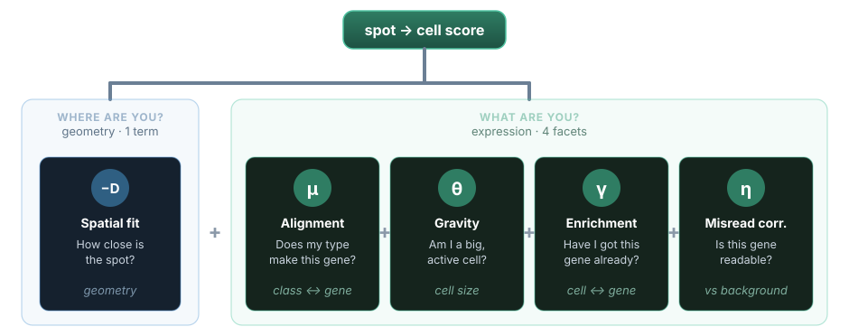

# Derivation: the spot-to-cell assignment $q(z)$

The last block of the loop assigns each spot to the cell most likely to have produced it,
or to the background. The latent variable is the indicator $z_{s,c}$, which is $1$ when spot
$s$ belongs to cell $c$. We derive its variational posterior $q(z_{s,c})$ the same way as
the other factors: keep the terms of the log-joint that involve $z_{s,c}$, take expectations
over everything else, and read off the result.

## Which terms involve $z_{s,c}$

Spots are modelled as a spatial Poisson process with intensity
$\lambda_{g,c}(x) = \theta_c\, \mu_{g,k(c)}\, e^{-D_c(x)}\, \gamma_{g,c}\, \eta_g$. A Poisson
log-likelihood has two parts, $-\!\int\!\lambda(x)\,dx + \sum_s \log\lambda(x_s)$. The
indicator $z_{s,c}$ appears **only in the second part**: it picks out the log-intensity of
the cell each spot is assigned to. Keeping just those terms,

$$
\log p(\dots) \supset
\sum_{s,c,k} z_{s,c}\, \zeta_{c,k}\,
  \log\!\big[\theta_c\, \mu_{g_s,k}\, e^{-D_c(x_s)}\, \gamma_{g_s,c}\, \eta_{g_s}\big]
\;+\; \sum_s z_{s,0}\, \log\rho_{g_s} ,
$$

where the last sum is the background option ($c = 0$), whose intensity is the per-gene
[misread density](misread-density.md) $\rho_{g_s}$.

The first Poisson part, $-\!\int\!\lambda\,dx$ (the expected total count, and the equivalent
$\rho_g A_{\text{total}}$ for the background), contains **no** $z_{s,c}$. It is the same
whichever cell the spot is handed to, so it is constant across the assignment and drops out
under the normalisation below. This is why the area of the tissue never enters the
competition.

## The update for a cell ($c > 0$)

The coordinate-ascent update sets $\log q(z_{s,c}=1)$ to the expectation of those terms over
the other factors:

$$
\log q(z_{s,c}=1)
= \mathbb{E}_{\zeta,\theta,\gamma,\eta}\!\Big[
  \sum_k \zeta_{c,k}\,
  \big(\log\theta_c - D_c(x_s) + \log\mu_{g_s,k} + \log\gamma_{g_s,c} + \log\eta_{g_s}\big)
\Big] + \text{const}.
$$

Now carry the expectations inside, and mind the **class conditioning**. The cell scale
$\theta_c$ and the gene-cell factor $\gamma_{g_s,c}$ are both estimated *conditional on the
class* (see [scale-theta](scale-theta.md) and [scale-gamma](scale-gamma.md)), so inside the
$k$-th term they take their class-$k$ values:
$\mathbb{E}[\log\theta_c] = \log\bar\theta_{c\mid k}$ and
$\mathbb{E}[\log\gamma_{g_s,c}] = \overline{\log\gamma}_{g_s,c\mid k}$. The efficiency
$\mathbb{E}[\log\eta_{g_s}] = \overline{\log\eta}_{g_s}$ is gene-only, with no $k$; and
$\mathbb{E}[\zeta_{c,k}] = \bar\zeta_{c,k}$ is the cell-class posterior. The distance
$D_c(x_s)$ is constant and $\sum_k \bar\zeta_{c,k} = 1$, so it comes out of the sum:

$$
\log q(z_{s,c}=1)
= - D_c(x_s)
  + \sum_k \bar\zeta_{c,k}
    \big(\log\bar\theta_{c\mid k} + \overline{\log\gamma}_{g_s,c\mid k} + \overline{\log\eta}_{g_s} + \log\mu_{g_s,k}\big)
  + \text{const}.
$$

Exponentiating gives the unnormalised score $S_{s,c}$ for assigning the spot to cell $c$.

## The background option ($c = 0$)

The only term carrying $z_{s,0}$ is the background log-intensity $\log\rho_{g_s}$ (its area
term $\rho_g A_{\text{total}}$ is constant in $z$ and cancels with the rest). So

$$
\log q(z_{s,0}=1) = \overline{\log\rho_{g_s}} + \text{const},
$$

the **expected log** misread density of the spot's gene, $\overline{\log\rho_{g_s}} =
\psi(\hat r_{g_s}) - \log\hat\beta_{g_s}$ (the digamma form derived on the
[misread density](misread-density.md) page). Exponentiated, the background contributes
$\exp(\overline{\log\rho_{g_s}})$ to the competition, with no distance, scale, or efficiency
term attached. Note this is **not** the posterior mean rate $\bar\rho_{g_s} = \mathbb{E}[\rho_{g_s}]$:
because $\mathbb{E}[\log\rho] \neq \log\mathbb{E}[\rho]$, the term $\exp(\overline{\log\rho_{g_s}})$
sits strictly below $\bar\rho_{g_s}$. This is the exact quantity the code uses for the
background column (`genes.log_rho_bar`).

## Normalisation

The indicator $z_s$ picks exactly one option, so the scores are normalised across the nearby
cells and the background by a softmax:

$$
q\big(c(s)=c\big) = \frac{\exp(S_{s,c})}{\sum_{c'>0}\exp(S_{s,c'}) + \exp(\overline{\log\rho_{g_s}})},
\qquad
q\big(c(s)=0\big) = \frac{\exp(\overline{\log\rho_{g_s}})}{\sum_{c'>0}\exp(S_{s,c'}) + \exp(\overline{\log\rho_{g_s}})} .
$$

Dropping the shared normaliser, the posterior is

$$
\boxed{\;
q\big(c(s)=c\big)
\propto
\begin{cases}
\exp\!\Big[
  - D_c(x_s)
  + \displaystyle\sum_k
    \Big(
      \bar\zeta_{c,k} \log\bar\theta_{c\mid k}
      + \bar\zeta_{c,k} \overline{\log\gamma}_{g_s,c\mid k}
      + \bar\zeta_{c,k} \overline{\log\eta}_{g_s}
      + \bar\zeta_{c,k} \log\mu_{g_s,k}
    \Big)
\Big], & c > 0, \\[2pt]
\exp(\overline{\log\rho_{g_s}}), & c = 0 \ \text{(background)} .
\end{cases}
\;}
$$

## Reading the terms

When a cell weighs up a spot, it asks it two questions: **where are you?** and **what are
you?** The first is geometry - how far the spot sits from the cell - and is settled by a
single **quantitative** term. The second is identity - whether a cell of this type would
produce this gene - and is settled by the **qualitative** terms. The score for a candidate
cell $c > 0$ is the sum of the two.

<figcaption>The score, block by block. One block asks <em>where</em> the spot is (the spatial term); four ask <em>what</em> it is. The score simply adds them up.</figcaption>

### The quantitative term: the spatial fit

$-D_c(x_s)$ is the **Gaussian log-likelihood** of the spot's location under cell $c$.
$D_c(x)$ is the quadratic (Mahalanobis) distance from $x$ to the cell's centre under the
cell's Gaussian shape, so $e^{-D_c(x)}$ is the corresponding Gaussian weight and
$-D_c(x_s)$ its logarithm. This is a hard geometric measurement - how well the spot's
position sits inside the cell's footprint - and it does not depend on which gene the spot
carries. Nearer spots score higher.

### The qualitative terms: does the gene belong here?

The remaining terms ask a different question: not *where* the spot lies, but *whether a cell
like this would express that gene*. Together they are the log expected count of the spot's
gene in cell $c$, and they break into **four facets**, each asking "does the gene belong
here?" from a different angle: the **alignment** (the cell's type), the **gravity** (the
cell's size), the **enrichment** (the cell's own history with the gene), and the **misread
correction** (the gene's detectability).

**The alignment term.** The class-compatibility part of the score is

$$
\sum_k \bar\zeta_{c,k}\,\log\mu_{g_s,k},
$$

an inner product between two vectors that run over the candidate classes:

- $\bar\zeta_{c,k}$ - the cell's **class posterior**: how confident we are that cell $c$ is
  each type. It is a probability distribution and sums to $1$.
- $\log\mu_{g_s,k}$ - the gene's **expression profile**: how strongly each class expresses
  the spot's gene $g_s$, taken from the scRNA-seq reference.

You can read this factor as the cell's **attention** over its candidate types, or as an
**alignment** between what the cell probably is and what the gene marks. We will call it the
alignment. Because $\bar\zeta_c$ sums to one, it is precisely the expected log-expression of
the gene under the cell's own belief about its class:

$$
\sum_k \bar\zeta_{c,k}\,\log\mu_{g_s,k} = \mathbb{E}_{k\sim\bar\zeta_c}\!\big[\log\mu_{g_s,k}\big].
$$

The alignment is large only when **two things line up at once**: the cell is *confident*
about its type (its posterior mass sits on a few classes) **and** those classes *express the
gene* (a high $\mu$). A cell that is sure of its type but of a type that does not produce
the gene scores low; a cell whose type does express the gene but which is itself uncertain
has its vote spread thin across classes. Confidence and expression multiply - neither alone
is enough.

Picture a spot of gene $g$ sitting exactly between two cells, with every other term equal.
The assignment is then decided by this one quantity, and the spot is drawn to the cell whose
class belief is **aligned** with the gene: the cell that is both confidently typed and of a
type that expresses $g$. That is the precise sense in which a cell "claims" a spot - it
attends to the types it might be, and the spot goes where that attention overlaps the gene's
expression.

**The gravity term.** The $\theta$ part of the score,

$$
\sum_k \bar\zeta_{c,k}\,\log\bar\theta_{c\mid k},
$$

has the very same shape as the alignment - a confidence-weighted average over the candidate
classes - but it weighs a different quantity. Each $\bar\theta_{c\mid k}$ is the cell's
[overall scale](scale-theta.md) assuming class $k$: its total observed count divided by the
total that class $k$ predicts. A cell pulling in *more* transcripts than its type expects has
$\bar\theta_{c\mid k} > 1$; a sparse one has $\bar\theta_{c\mid k} < 1$. And because
$\bar\zeta_c$ sums to one, this term too is an expectation under the cell's belief about its
class:

$$
\sum_k \bar\zeta_{c,k}\,\log\bar\theta_{c\mid k} = \mathbb{E}_{k\sim\bar\zeta_c}\!\big[\log\bar\theta_{c\mid k}\big].
$$

Read $\bar\theta_{c\mid k}$ as the cell's **mass** - how much signal it is already gathering -
and the term as its **gravity**, the pull it exerts on a nearby spot. Where the alignment
asked *which* type the gene points to, gravity asks *how big* the candidate cell is. A heavy
cell pulls harder: with everything else equal, a spot drifts toward whichever cell is already
capturing the most transcripts. And, exactly as with alignment, **confidence sharpens the
pull**: a cell that is sure of its type concentrates its weight on a single
$\bar\theta_{c\mid k}$, so a confidently rich cell pulls hardest, while a rich-but-uncertain
cell has its pull spread thin across the types it might be.

Picture once more a spot of gene $g$ between two cells, with every other term equal - even
their alignment. The spot now goes to the cell with the greater gravity: the one already
gathering more transcripts, and confident about what it is. This is a "rich-get-richer" pull,
and it is the sensible thing: a clearly active, transcript-rich cell should claim the
ambiguous spots around it rather than cede them to a sparse or uncertain neighbour. The
[prior $r_\theta$](scale-theta.md) is what keeps it honest, tempering $\bar\theta_{c\mid k}$
back toward $1$ so a cell cannot inflate its own mass without the counts to back it up.

**The enrichment term.** Close to the alignment in form, but answering a different question,
is the $\gamma$ part of the score,

$$
\sum_k \bar\zeta_{c,k}\,\log\bar\gamma_{g_s,c\mid k},
$$

once more a confidence-weighted average over the candidate classes - this time of
$\bar\gamma_{g_s,c\mid k}$, **this cell's** observed-over-expected count for gene $g_s$
assuming class $k$. A cell carrying *more* of the gene than its type predicts has
$\bar\gamma_{g_s,c\mid k} > 1$ (**enriched**); one carrying less has it below $1$
(**depleted**). As before, it is an expectation under the cell's class belief:

$$
\sum_k \bar\zeta_{c,k}\,\log\bar\gamma_{g_s,c\mid k} = \mathbb{E}_{k\sim\bar\zeta_c}\!\big[\log\bar\gamma_{g_s,c\mid k}\big].
$$

This is the one facet easily confused with the alignment, so the difference is worth stating
plainly:

- **alignment** ($\mu$) is **class $\leftrightarrow$ gene**: does a cell of this *type*
  express the gene? It comes from the reference and is the **same for every cell of that
  type**.
- **enrichment** ($\gamma$) is **cell $\leftrightarrow$ gene**: does *this individual cell*
  carry more of the gene than its type predicts? It comes from the cell's **own data**.

The sharpest way to see they differ: take two cells of the **same type** with a gene-$g$ spot
between them. Their alignment is identical - same type, same $\mu$ - so it cannot break the
tie. Their enrichment can differ: the cell that has already gathered more of gene $g$ than
its type accounts for has the higher $\bar\gamma$, and it claims the spot. **Alignment tells
different types apart; enrichment tells same-type cells apart.** The two stack because the
predicted count factorises as $\mu \times \gamma$ - the type's baseline times the cell's
residual - so enrichment carries exactly the part of the signal the alignment leaves
unexplained.

**The misread correction.** The fourth facet, $\overline{\log\eta}_{g_s}$, is the gene's
detection efficiency, and it is the odd one out: it does not depend on the cell's class (it
is gene-only), and between two cells it is a common offset that cancels, so it never decides
which cell wins. Its work is in the **cell-versus-background** contest - attenuating the
signal of a poorly detected gene so its spots are more readily called misreads. Because that
is a story about the background option, we unpack it in
[its own section below](#the-efficiency-term-and-the-signal-to-noise-ratio).

For the background option $c = 0$ the score is the spot's gene
[misread density](misread-density.md), entered as $\exp(\overline{\log\rho_{g_s}})$. A spot
is assigned to the background unless some nearby cell explains it better, which is how
genuine misreads are filtered out.

## The efficiency term and the signal-to-noise ratio

A subtle point, and the subject of [errata item 1](errata.md): although the efficiency
term $\overline{\log\eta}_{g_s}$ is the same for every cell $c > 0$, it does **not** cancel
during normalisation, because the assignment is also compared against the background
$\rho_{g_s}$, which carries no efficiency term. A low-efficiency gene therefore has its
signal attenuated relative to the background, making its spots more likely to be deemed
misreads. The original paper omitted this term, effectively treating every gene as perfectly
detected during assignment; including it lets $\eta$ act as a gene-specific scaling of the
signal-to-noise ratio.
